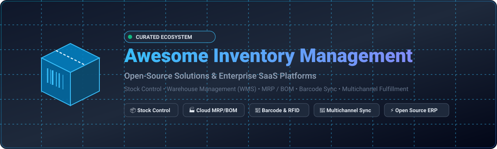

  

  
  
  
  
  
  
  

---

# 📦 Awesome Inventory Management 

> 🚀 A curated list of awesome **Inventory Management Systems (IMS)**, **Warehouse Management Systems (WMS)**, **Manufacturing Resource Planning (MRP)** tools, **Stock Control Applications**, and **Open-Source GitHub Projects**.

Whether you run an omnichannel e-commerce store, a discrete manufacturing shop, a 3PL logistics warehouse, an IT asset department, or an electronics lab, this guide covers production-tested commercial SaaS platforms and free self-hosted open-source software.

---

## 📑 Table of Contents

- [🌟 Market Overview & Industry Dynamics](#-market-overview--industry-dynamics)
- [🏢 SaaS & Hosted Commercial Platforms](#-saas--hosted-commercial-platforms)
- [💻 Open-Source GitHub Projects](#-open-source-github-projects)
- [🔍 Key Features Matrix & Use Cases](#-key-features-matrix--use-cases)
- [🛠️ Developer Tools & Hardware Integrations](#️-developer-tools--hardware-integrations)
- [🤝 How to Contribute](#-how-to-contribute)
- [📈 Star History](#-star-history)
- [📜 License & Disclaimer](#-license--disclaimer)

---

## 🌟 Market Overview & Industry Dynamics

> 📊 **Estimated Market Size & Fragmentation Analysis (2026)**:  
> The global **Inventory Management Software Market** is valued at approximately **$5.4 Billion USD in 2026** and is projected to expand to **$10.8 Billion USD by 2032**, registering a compound annual growth rate (**CAGR of ~10.5%**).  
>
> 🧩 **Market Fragmentation**: The sector is **moderately-to-highly fragmented** rather than a winner-take-all monopoly. The ecosystem splits across distinct operating models:
> 1. **Enterprise ERP Suites** (Oracle NetSuite, SAP, Microsoft Dynamics 365) powering multi-subsidiary financials and complex supply chains.
> 2. **Mid-Market Specialized WMS/MRP** (Cin7 Core, Katana MRP, Fishbowl, Unleashed) tailored for discrete manufacturing, batch tracing, and multi-location warehouses.
> 3. **High-Velocity E-Commerce & Retail Connectors** (Zoho Inventory, Linnworks, Skubana, Finale, inFlow) orchestrating real-time multichannel sync (Shopify, Amazon, eBay, TikTok Shop).
> 4. **Self-Hosted Open-Source Systems** (Odoo Community, ERPNext, InvenTree, Snipe-IT) offering 100% data sovereignty, custom API extensions, and zero per-seat licensing fees.

---

## 🏢 SaaS & Hosted Commercial Platforms

Below is a comparison of leading commercial Inventory & Order Management platforms, sorted by **Company Scale / Valuation / Revenue (Descending)**.

| Platform | Key Focus & Capabilities | Company Scale / Valuation / Revenue | Starting Pricing | Free Tier / Trial Limits |
| :--- | :--- | :--- | :--- | :--- |
| **[NetSuite Inventory Management](https://www.netsuite.com/)** | 🏢 Enterprise ERP suite with multi-subsidiary demand planning, lot/serial tracking, matrix items, and native accounting. | **~$400B+ MCap** (Oracle) / **~$3B+ Annual Revenue** (NetSuite) | **~$999/month** base platform license + **~$99/user/month** (annual contract) | **14-day guided demo account** provisioned via certified Oracle/NetSuite partner sandbox |
| **[Zoho Inventory](https://www.zoho.com/inventory/)** | 🌐 Cloud-native inventory integrated with Zoho suite; handles multichannel sales, dropshipping, and batch tracking. | **~$15B - $20B Valuation** / **~$1.5B+ Annual Revenue** (Zoho Corp) | **$29/month** (Standard plan billed annually; includes 500 orders/mo, 2 users, 1 warehouse) | **Forever-free plan** limited to 50 orders/month, 1 user, and 1 warehouse location; **14-day free trial** for paid tiers |
| **[Cin7 (Cin7 Core / DEAR)](https://www.cin7.com/)** | 🔄 Multichannel retail/wholesale inventory, B2B portal, 3PL integrations, warehouse barcode automation, and POS sync. | **~$500M - $1B Valuation** / **~$100M+ Annual Revenue** (Rubicon Partners) | **$349/month** (Standard plan; includes 5 users, 2 integrations, 6,000 orders/yr) | **14-day free trial** with full feature access (no credit card required; up to 30 days for select add-on modules) |
| **[Brightpearl](https://www.brightpearl.com/)** | 🛍️ Retail Operating System (ROS) built for high-growth omnichannel brands with built-in accounting, CRM, and POS. | **$360M Acquisition Valuation** / **~$40M+ Annual Revenue** (Sage Group) | **~$1,500/month** (bespoke merchant tier with unlimited user seats included) | **1:1 consultative demo** and guided Technical Solution Proposal (TSP) scoping session |
| **[Skubana (Extensiv)](https://www.extensiv.com/)** | 📦 Multichannel order routing, inventory synchronization, and profitability analytics for 3PLs and high-velocity brands. | **~$300M+ Valuation** / **~$40M+ Annual Revenue** (Mainsail Partners) | **~$999/month** (Extensiv Order Manager base tier; Integration Manager starts at **$39/month**) | **30-day free trial** for Integration Manager; live tailored sandbox walkthrough demo for Order Manager |
| **[Fishbowl](https://www.fishbowlinventory.com/)** | 🏭 Advanced inventory, lot traceability, work orders, and manufacturing with deep bi-directional QuickBooks sync. | **~$200M+ Valuation** / **~$60M+ Annual Revenue** (Diversis Capital) | **$229/month** (Essentials plan, 2 users, billed annually) | **14-day trial database access** via sales-assisted sandbox / guided 1:1 live product evaluation demo |
| **[Katana](https://katanamrp.com/)** | ⚙️ Visual Cloud MRP and inventory platform with real-time shop floor control, BOMs, and automated material allocation. | **~$150M - $200M Valuation** / **~$20M+ Annual Revenue** ($41M Series B funded) | **$299/month** (Core plan, billed annually) | **Forever-free plan** limited to 30 SKUs and 3 inventory locations; **15-day free trial** with unrestricted full features |
| **[Unleashed](https://www.unleashedsoftware.com/)** | 📊 Accurate perpetual stock tracking, multi-currency purchasing, B2B store, and production control for distributors. | **~$150M+ Valuation** / **~$30M+ Annual Revenue** (The Access Group) | **$399/month** (Core plan, billed annually) | **14-day free trial** with complete platform access and sandbox data (no credit card required) |
| **[Linnworks](https://www.linnworks.com/)** | 🌍 Centralized marketplace listings, stock allocation, shipping automation, and warehouse management. | **~$120M - $150M Valuation** / **~$40M+ Annual Revenue** (Marlin Equity) | **~$1,000/month** (tier scaled on GMV and monthly processed order volume) | **Live interactive demo** with tailored workflow evaluation and customized trial environment upon request |
| **[inFlow Inventory](https://www.inflowinventory.com/)** | 📱 User-friendly inventory with mobile barcode scanning, assembly BOMs, purchase orders, and dedicated B2B showroom. | **~$50M - $70M Valuation** / **~$12M - $15M Annual Revenue** (Bootstrapped, 40k+ users) | **$129/month** (Entrepreneur plan billed annually; 2 users, 1 location, 100 orders/mo) | **14-day free trial** with full feature access and unlimited products (no credit card required) |
| **[Sortly](https://www.sortly.com/)** | 🏷️ Visual inventory and physical asset tracking app with custom QR/barcode generation and offline mobile support. | **~$30M - $50M Valuation** / **~$8M - $10M Annual Revenue** ($15M+ VC funding) | **$49/month** (Advanced plan billed annually; includes 2 users and 2,000 items) | **Forever-free plan** limited to 1 user and 100 unique items (1 custom field); **14-day free trial** for paid plans |
| **[Finale Inventory](https://www.finaleinventory.com/)** | ⚡ High-throughput multichannel fulfillment, dynamic reorder points, kitting/bundling, and rugged barcode terminal support. | **~$25M - $40M Valuation** / **~$10M - $15M Annual Revenue** (Descartes network) | **$499/month** (Essentials tier, month-to-month terms) | **14-day free trial** with full functionality including mobile barcode scanning app testing |

---

## 💻 Open-Source GitHub Projects

Self-hosted, transparent, and extensible open-source solutions sorted by **GitHub Stars (Descending)**.

| Project & Repository | GitHub Stars | Primary Language / Stack | Key Features & Best Use Case |
| :--- | :--- | :--- | :--- |
| **[Odoo Community](https://github.com/odoo/odoo)** |  | Python, JavaScript | Complete modular ERP ecosystem. The Inventory module provides double-entry stock management, automated replenishment, cross-docking, drop-shipping, and barcode scanning. |
| **[Snipe-IT](https://github.com/snipe/snipe-it)** |  | PHP (Laravel), Vue | Industry standard for IT asset management (ITAM). Tracks hardware lifecycle, software licenses, component accessories, checkouts, and barcode/QR audits. |
| **[ERPNext](https://github.com/frappe/erpnext)** |  | Python (Frappe), JS | Comprehensive full-suite open-source ERP. Robust multi-warehouse stock valuation (FIFO/Moving Average), serialized/batched inventory, BOMs, and manufacturing work orders. |
| **[Grocy](https://github.com/grocy/grocy)** |  | PHP, SQLite | Self-hosted ERP and inventory system for groceries, household items, meal planning, chores, and equipment tracking with built-in barcode scanner. |
| **[Homebox](https://github.com/syslogic/homebox)** |  | Go, SQLite | Lightweight, fast self-hosted home and small-office inventory system with asset tracking, label generation, warranty tracking, and custom fields. |
| **[InvenTree](https://github.com/inventree/InvenTree)** |  | Python (Django), React | Low-level part and component inventory management. Designed for engineers and manufacturers with multi-level BOMs, supplier part numbers, purchase orders, and REST API. |
| **[GreaterWMS](https://github.com/GreaterWMS/GreaterWMS)** |  | Python (Django), Vue | Production-grade open-source Warehouse Management System (WMS) supporting multi-warehouse space allocation, picking, packing, sorting, and cross-border logistics. |
| **[Shelf.nu](https://github.com/shelf-nu/shelf.nu)** |  | TypeScript, Node.js | Modern open-source asset management infrastructure. Generate customizable QR tags, track item ownership, manage check-in/check-out flows, and integrate with mobile. |
| **[Part-DB](https://github.com/Part-DB/Part-DB-server)** |  | PHP (Symfony) | Electronic component inventory database. Manages small parts, footprints, manufacturers, datasheets, storage locations, and automated parametric search. |
| **[OpenBoxes](https://github.com/openboxes/openboxes)** |  | Groovy, Grails, Java | Open-source supply chain and inventory management system designed for healthcare, hospitals, cold chains, pharmaceutical expiration tracking, and humanitarian relief. |
| **[PartKeepr](https://github.com/partkeepr/PartKeepr)** |  | PHP, ExtJS | Dedicated electronic components and sub-assembly inventory manager with footprint, part parameter, and storage location hierarchy tracking. |
| **[MyCompany (lsFusion)](https://github.com/lsfusion-solutions/mycompany)** |  | Java, lsFusion | All-in-one open-source trade and warehouse management system for small businesses, covering purchasing, stocktaking, sales orders, and point of sale (POS). |
| **[Inventory Tools for ERPNext](https://github.com/agritheory/inventory_tools)** |  | Python (Frappe) | Enhanced inventory utilities, batch barcode printing, and shop floor tooling extending standard Frappe ERPNext capabilities. |

---

## 🔍 Key Features Matrix & Use Cases

| Capability / Requirement | Recommended Commercial SaaS | Recommended Open-Source Solution |
| :--- | :--- | :--- |
| **Electronic Components & BOMs** | Katana MRP, Cin7 Core | [InvenTree](https://github.com/inventree/InvenTree), [Part-DB](https://github.com/Part-DB/Part-DB-server) |
| **Enterprise Multi-Entity ERP** | Oracle NetSuite | [ERPNext](https://github.com/frappe/erpnext), [Odoo Community](https://github.com/odoo/odoo) |
| **Omnichannel E-Commerce Sync** | Linnworks, Skubana, Zoho Inventory | [Odoo](https://github.com/odoo/odoo) with eCommerce connectors |
| **Large Scale Warehouse (WMS)** | Finale Inventory, Fishbowl | [GreaterWMS](https://github.com/GreaterWMS/GreaterWMS) |
| **IT & Physical Asset Tracking** | Sortly | [Snipe-IT](https://github.com/snipe/snipe-it), [Shelf.nu](https://github.com/shelf-nu/shelf.nu) |
| **Healthcare & Cold Chains** | NetSuite Advanced Inventory | [OpenBoxes](https://github.com/openboxes/openboxes) |
| **Home & Personal Labs** | Sortly (Free Plan) | [Homebox](https://github.com/syslogic/homebox), [Grocy](https://github.com/grocy/grocy) |

---

## 🛠️ Developer Tools & Hardware Integrations

- 📷 **Barcode & QR Generators**: Native libraries like `python-barcode`, `jsbarcode`, and `zxing` for label formatting (ZPL / EPL) on Zebra and Dymo printers.
- 📱 **Mobile Terminals & Scanners**: Support for Android Honeywell, Zebra TC-series, and iOS camera scanning for real-time picking/packing.
- 🔄 **REST / GraphQL APIs**: Standard JSON endpoints across InvenTree and ERPNext for integrating ERP webhooks with custom microservices and automated storage units.

---

## 🤝 How to Contribute

Contributions are warmly encouraged! Follow these steps to submit additions or corrections:

1. 🍴 **Fork** this repository.
2. 🌿 **Create a branch** for your feature (`git checkout -b add-inventory-tool`).
3. 📝 **Add your entry** to either the SaaS table or Open-Source table maintaining the established column structure and descending sort order.
4. 🔗 **Verify links and facts**: Ensure documentation, star badge syntax, pricing tiers, and trial limits are accurate.
5. 🚀 **Submit a Pull Request** with a concise description of your changes.

---

## 📈 Star History

---

## 📜 License & Disclaimer

- Distributed under the **MIT License**.
- *Disclaimer*: Product names, logos, and brands are property of their respective owners. Pricing, feature limits, and star counts are subject to change by their respective maintainers and vendors.

---

  <b>Curated with ❤️ for operations managers, warehouse engineers, makers, and developers worldwide.</b>

